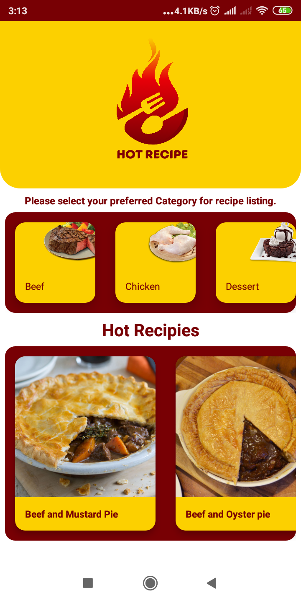
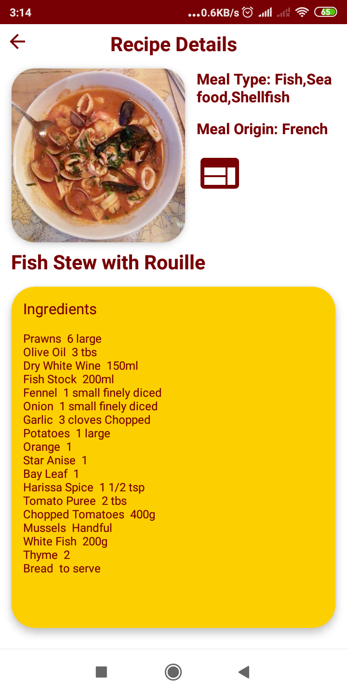
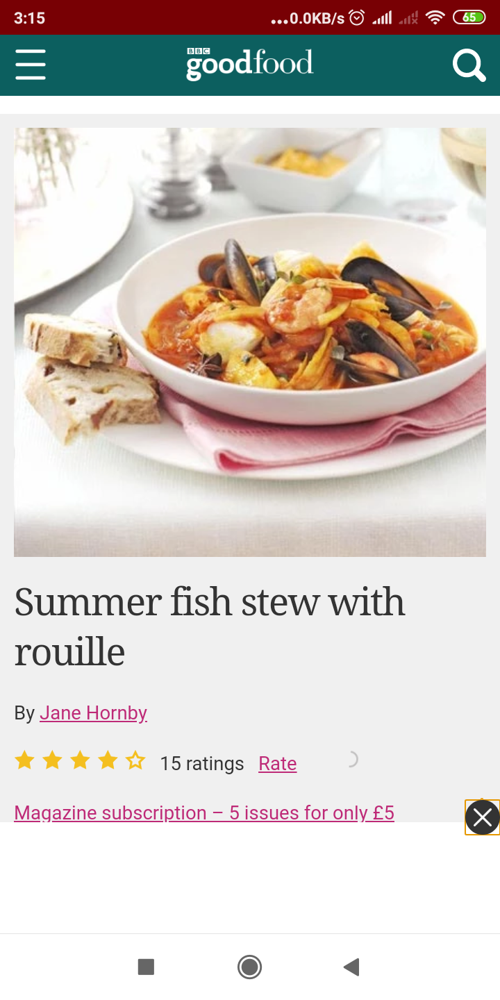

# HotRecipeApp
Simple recipe app

# HotRecipeApp
- Android studio 
- MVVM Architecture & ViewModel
- Live data 
- Navigation
- Room
- Dagger-Hilt
- Retrofit 
- themealdb API

# UI Screenshot
  
  
